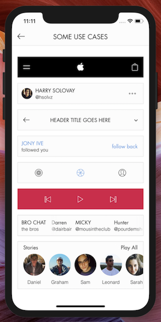

<h1 align='center'>React Native X Bar</h1>

<h3 align='center' style="padding-top : 10px">An easy-to-use bar component for reducing UI/styling complexity</h3>

<h4 align='center' style='margin-top : -10px;'>Clean, elegant, extensible bars for almost all use cases 🎩🐰</h4>

<br>
<p align="center" >
    
</p>
<br>
<p align="center" >
    
    <br><br>
    <a href='https://expo.io/@hsolvz/react-native-x-bar-example'>Try out the demo app<br>with Expo Client</a>
</p>


## Overview

Time and time again, developers must implement the same-old bar UI. There is–pretty much always–a need for components such as headers, list items, tab bars, search bars, card headings, etc. There's a whole world of bars, ranging in form and function… and a lot of them are so, damn, simple! Does their simplicity justify us needing to always re-create them? If you just answered no, you are absolutely correct! Now then, let X Bar take care of your bar needs, and say goodbye to hundreds of lines of useless bar boilerplate.


#### features:

* smooth, easy-to-use layouts
* no limit to the number of slots that can be added in a given XBar
* slot-grouping
* horizontally scrollable slots
  * fade effect on either side of the overflown slot
* impeccable onPress handling
  * simultaneously assign onPress for individual slots, all slots, and container
  * assign order of onPress executions with the "onPressPriority" prop
* easily style every crevace to perfection
* if you want a new feature, shoot me an email at harrysolovay@gmail.com and I'll see what I can do 💪


## Quick start


1. **Install via your preferred package manager:**

```sh
yarn add react-native-x-bar
```

```shell
npm i react-native-x-bar -S
```


2. **Import XBar:**

```javascript
import XBar from 'react-native-x-bar'
```


3. **Create an XBar instance:**

```Jsx
<XBar
  slots={[
    { children : <Text>first</Text> },
    { children : <Text>second</Text> },
    { children : <Text>third</Text> }
  ]}
/>
```


4. **Pick a layout ([click here for a full list of options](#layouts)):**

```jsx
<XBar
  { /* same as above */ }
  layout='space between'
/>
```


5. **Make it pop**

```jsx
<XBar
  slots={[
    { style : { /* styles to be applied to all slots */ } }
    [
      {
        children : <Text>first</Text>,
        style : { /* first slot styles */ }
      },
      {
        children : <Text>second</Text>,
        style : { /* second slot styles */ }
      },
      {
        children : <Text>third</Text>,
        style : { /* third slot style */ }
      }
    ]
  ]}
  layout='space between'
  style={ /* styles for the container */ }
/>
```


## Guide

- [running the example app](#Running-the-example-app)
- [adding slots](#adding-slots)
- [layouts](#layouts)
- [configuring an individual slot](#configuring-an-individual-slot)
- [configuring all slots](#configuring-all-slots)
- [configuring the container](#configuring-the-container)
- [grouping slots](#grouping-slots)
- [overflowing slots](#overflowing-slots)
- [advanced onPress handling](#advanced-onpress-handling)
- [misc.](#miscellaneous)


## Running the example app

##### Running the example app requires that you have the [expo CLI](expo client) installed

1. **download or clone the [react-native-x-bar](https://github.com/harrysolovay/react-native-x-bar) repository**
2. **open the repository in terminal and CD into ./example**
3. **install example dependencies (with Yarn or npm)**
4. **run the following command to start the Expo packager:**

````shell
exp start
````

5. **follow [Expo's instructions](https://docs.expo.io/versions/v26.0.0/workflow/up-and-running) to run in the simulator or on your device**


## Adding Slots

Adding slots to an XBar is ridiculously easy:

````jsx
<XBar
  slots={[
    { children : <Text>This text component will be placed in the first slot</Text> },
    { children : <Text>This one, in the second slot</Text> },
    { children : <Text>And this one, in the third</Text> }
  ]}
/>
````

You can add as many slots as you'd like… although it won't look particularly good if there are so many slots that they push oneanother out of the view. If you're running into the need for more room horizontally, consider using the [overflow prop](#overflowing-slots).


## Layouts

Depending on what other props you're using, there might not be a need for the layout prop at all. Avoid using the layout prop if you're overflowing one of the slots or if you want the slots to float/align to one particular direction.

#### Using the 'layout' prop:

````jsx
<XBar
  slots={[
    { children : <Text>first</Text> },
    { children : <Text>second</Text> },
    { children : <Text>third</Text> }
  ]}
  layout='space around'
/>
````

| layout options             | Appearance                                                   |
| -------------------------- | ------------------------------------------------------------ |
| null <undefined>           | slots will float/align to the left                           |
| 'absolute center' <String> | slots[1] or group at [1] relative to other slots and groups will be centered absolutely |
| 'space between' <String>   | will equally distribute available horizontal space between slots |
| 'space equal' <String>     | the available horizontal space will be divided by the number of slots – each slot will be centered in a view that takes up that calulated width |
| 'space around' <String>    | slots have half of their chunk of the evenly distributed available horizontal space on either side of them |
| 'space evenly' <String>    | will equally distribute available horizontal space between slots and the container walls |

##### layout caveats

* 'absolute center':

  * The container resizes only to non-absolutely-positioned component heights (might need to set container to fixed height with 'style' prop––otherwise, the absolutely positioned component could break out of the container)
  * This positioning doesn't allow you to define relationships between slot and group spacing (it's absolute, after all)

* 'space equal':

  *  if using the groups prop, the width of each slot container = the number of groups + the number of slots – the number of grouped slots

  ​

## Configuring an individual slot

Each slot can be passed several props: children, overflow, style, onPress and activeOpacity. Here is an example of an XBar configured with a single slot that makes use of all five of these props:


````jsx
<XBar
  slots={[
    {
      children : <Text>This text component is inside of a slot that has the overflow prop defined and is therefore scrollable!</Text>,
      overflow : {
        effect : 'fade',
        effectConfig : {
          color : 'yellow',
          LinearGradient
        }
      },
      style : {
        backgroundColor : 'yellow',
        padding : 20
      },
      onPress : () => console.log('a scrollable slot was pressed!'),
      activeOpacity : .5
    }
  ]}
/>
````


## Configuring all slots

The same properties (except for children) can be configured in all slots simultaneously with a slight change to the slots config. We can turn this:

````jsx
<XBar
  slots={[
    {
      children : <Text>first</Text>
      style : {
        backgroundColor : 'yellow',
        padding : 20
      }
    },
    {
      children : <Text>second</Text>
      style : {
        backgroundColor : 'yellow',
        padding : 20
      }
    },
    {
      children : <Text>third</Text>
      style : {
        backgroundColor : 'yellow',
        padding : 20
      }
    }
  ]}
/>
````

… into this:

````jsx
<XBar
  slots={[
    {
      style : {
        backgroundColor : 'yellow',
        padding : 20
      }
    },
    [
      { children : <Text>first</Text> },
      { children : <Text>second</Text> },
      { children : <Text>third</Text> }
    ]
  ]}
/>
````

And voila! The backgroundColor and padding styles will get applied to each of the slots. The same concept also applies for onPress, activeOpacity and overflow.


## Configuring the container

If we want to add style, onPress and activeOpacity directly to the XBar, it will attach them to the slots'/groups' parent container (the outermost View):

````jsx
<XBar
  slots={[
    {
      style : {
        backgroundColor : 'yellow',
        padding : 20
      }
    },
    [
      { children : <Text>first</Text> },
      { children : <Text>second</Text> },
      { children : <Text>third</Text> }
    ]
  ]}
  onPress={ () => console.log('the entire XBar was pressed!') }
  activeOpacity={ .5 }
  style={{
    height : 50,
    borderColor : '#ddd',
    borderWidth : 1,
    borderRadius : 2
  }}
/>
````


## Grouping slots

With a given layout, we may run into a situation where we would like to position two slots together without breaking the rules for that layout (which we want to treat the two slots as a single slot).


Let's say we want to create the following social media card heading component:


We can achieve this layout with the following:

````jsx
<XBar
  slots={[
    {
      children : (
        <Image
          source={ require('./path/to/avatar.jpg') }
          style={{
            width : 60,
            height : 60
          }}
        />
      )
    },
    { children : <Text>Sir Jony Ive</Text> },
    {
      children : (
        <Ionicons
          name='ios-more-outline'
          size={ 30 }
        />
      )
    }
  ]}
  groups={[ 0, 1 ]}
/>
````


If you only want to create **one group**, set groups to be an array with the given slot indices

**must be input sequentially:**

good:

````jsx
groups={[ 2, 3 ]}
````

Bad:

````jsx
groups={[ 3, 2 ]}
````


If you want to create an XBar with **multiple slot groups**, set groups to an array of arrays of the given slot indices

**must also be input sequentially**

good:

````jsx
groups={[ [1, 2], [6, 8], [9, 10] ]}
````

bad:

````jsx
groups={[ [6, 8], [1, 2], [9, 10] ]}
````

I'm currently working on an algorithm that will handle even non-sequential group definitions (for the time being, I hope this isn't too much of a challenge 😉)


## Overflowing slots

Overflowing (making a slot horizontally scrollable) can be really useful when you need to display information within the same component, but don't want to use up screen real-estate that could go to better use. Overflowing slots is super easy with XBar. Let's take a look at a modified version of the example from earlier.

````jsx
<XBar
  slots={[
    {
      children : <Text>This text component is inside of a slot that has the overflow prop defined and is therefore scrollable!</Text>,
      overflow : {
        effect : 'fade',
        effectConfig : {
          width : 30,
          color : 'yellow',
          LinearGradient
        }
      },
      style : {
        backgroundColor : 'yellow',
        padding : 20
      }
    }
  ]}
/>
````

**effect:** For now the only effect other than 'fade' is 'clip' (content, scrolling out of the view, immediately disappears from visibility as it passes underneath and across the bounds of the slot).

**effectConfig** (no need to use if effect is set to 'clip') **:**

* **width:** the width of the fade components on either side of the overflown slot
* **color:** depending on the backgroundColor applied to either the slot(s) or entire XBar, you might want to change the color of the fade (I could automate this to draw from the available styles, but I figured doing so would result in collisions when both are defined… and I didn't want to define a 'fadeColorSourcePriority' prop… that seemed kind of messy. Please let me know if you think of an alternative solution that eliminates the need to define color)
* **LinearGradient:** the LinearGradient class or function is drawn from your choice of provider. In the case of the example app, Expo is the provider. If you'd prefer not to use Expo, you'll probably want to use [react-native-linear-gradient](https://github.com/react-native-community/react-native-linear-gradient).


## Advanced onPress handling

Sometimes, we might want to attach an onPress method to individual slots, as well as to all slots, as well as to the entire XBar. For example:

1. onFirstSlotPress = () => console.log('the first slot was pressed')
2. onSecondSlotPress = () => console.log('the second slot was pressed')
3. onAnySlotPress = () => console.log('one of the slots was pressed')
4. onXBarPress = () => console.log('the XBar was pressed')

We can assign the respective onPress handlers like this:

````jsx
<XBar
  slots={[
    {
      onPress : () => console.log('one of the slots was pressed')
    },
    [
      {
        children : <Text>first</Text>,
        onPress : () => console.log('the first slot was pressed')
      },
      {
        children : <Text>second</Text>,
        onPress : () => console.log('the second slot was pressed')
      }
    ]
  ]}
  onPress={ () => console.log('the XBar was pressed') }
/>
````

There's one problem with this implimentation… which methods fire first? This is where the **onPressPriority** prop comes in. Defaulting to [ 'slot', 'slots', 'container' ], this prop should be passed an array consisting of some combination of the three enums.


## Miscellaneous

Thank you for checking out (maybe even building software with) X Bar. If you have any bug reports or feature ideas, please go ahead and file an issue. If you have any other questions, comments, etc., please reach out to me at harrysolovay@gmail.com.


## Acknowledgements

Big shout out to...

* [William Barnes](https://www.linkedin.com/in/william-barnes-7296543/)
* [Daniel Shaffer](https://github.com/danielshaffer)

This library has been released under the [MIT license](../blob/master/LICENSE)

**SO DO WHATEVER THE $%#@ YOU WANT WITH IT!!!**